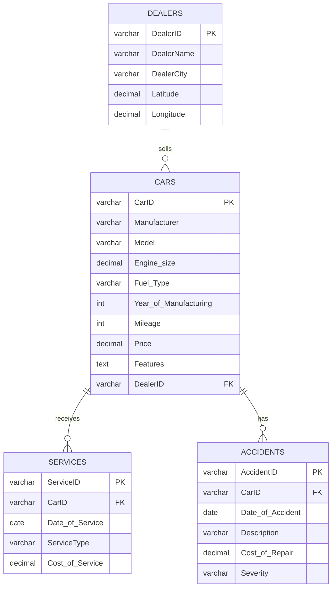

# Data Cleaning & Preprocessing Report

## Overview

This document describes the data cleaning and preprocessing steps applied to transform the raw `CarSales_Dataset.csv` into normalized CSV files.

**Input:** `CarSales_Dataset.csv` (99,817 rows, 22 columns)

**Output:**
- `cars_cleaned.csv` (15,000 rows)
- `dealers_cleaned.csv` (50 rows)
- `services_cleaned.csv` (17,977 rows)
- `accidents_cleaned.csv` (22,707 rows)

---

## 1. Issues Identified in Raw Data

| Issue | Description |
|-------|-------------|
| **Redundancy** | 99,817 rows for 15,000 cars (6.65x redundancy) |
| **Multi-valued Features** | Each feature creates a new row |
| **Date Format** | DD/MM/YYYY instead of ISO 8601 |
| **Denormalized** | All entities in single flat table |
| **Transitive Dependency** | Dealer info repeated for each car |

---

## 2. Transformation Steps

### Step 1: Aggregate Features

**Problem:** One row per feature causes redundancy.

```python
# Group features by CarID into a list
car_features = df.groupby('CarID')['Features'].apply(
    lambda x: list(x.unique())
).reset_index()

# Result: ['Bluetooth', 'Heated Seats'] instead of 2 rows
```

**Before:**
```
CarID   | Features
C33554  | Bluetooth
C33554  | Heated Seats
```

**After:**
```
CarID   | Features
C33554  | Bluetooth, Heated Seats
```

---

### Step 2: Extract Unique Cars

```python
# Get unique car records
cars_df = df.drop_duplicates(subset='CarID')[
    ['CarID', 'Manufacturer', 'Model', 'Engine size', 'Fuel_Type', 
     'Year_of_Manufacturing', 'Mileage', 'Price']
].copy()

# Merge aggregated features
cars_df = cars_df.merge(car_features, on='CarID', how='left')
```

**Result:** 99,817 rows → 15,000 unique cars

---

### Step 3: Create Dealers Table

**Problem:** Dealer info repeated for every car row.

```python
# Extract unique dealers
dealers_df = df[['DealerName', 'DealerCity', 'Latitude', 'Longitude']].drop_duplicates()

# Generate DealerID
dealers_df = dealers_df.reset_index(drop=True)
dealers_df['DealerID'] = 'D' + (dealers_df.index + 1).astype(str).str.zfill(5)

# Link cars to dealers via DealerID
cars_df = cars_df.merge(
    dealers_df[['DealerName', 'DealerCity', 'DealerID']], 
    on=['DealerName', 'DealerCity'], 
    how='left'
)

# Remove redundant dealer columns from cars
cars_df = cars_df.drop(columns=['DealerName', 'DealerCity', 'Latitude', 'Longitude'])
```

**Result:** 50 unique dealers with IDs (D00001 - D00050)

---

### Step 4: Extract Services

```python
# Get unique service records (exclude NULL)
services_df = df[df['ServiceID'].notna()][
    ['ServiceID', 'CarID', 'Date_of_Service', 'ServiceType', 'Cost_of_Service']
].drop_duplicates()
```

**Result:** 17,977 unique service records

---

### Step 5: Extract Accidents

```python
# Get unique accident records (exclude NULL)
accidents_df = df[df['AccidentID'].notna()][
    ['AccidentID', 'CarID', 'Date_of_Accident', 'Description', 
     'Cost_of_Repair', 'Severity']
].drop_duplicates()
```

**Result:** 22,707 unique accident records

---

### Step 6: Normalize Date Format

**Problem:** Dates in DD/MM/YYYY format.

```python
# Convert to ISO 8601 format (YYYY-MM-DD)
services_df['Date_of_Service'] = pd.to_datetime(
    services_df['Date_of_Service'], 
    format='%d/%m/%Y',
    errors='coerce'
).dt.strftime('%Y-%m-%d')

accidents_df['Date_of_Accident'] = pd.to_datetime(
    accidents_df['Date_of_Accident'], 
    format='%d/%m/%Y',
    errors='coerce'
).dt.strftime('%Y-%m-%d')
```

**Before:** `23/05/2024`  
**After:** `2024-05-23`

---

### Step 7: Handle Missing Values

```python
# Remove rows with invalid dates
services_df = services_df[services_df['Date_of_Service'].notna()]
accidents_df = accidents_df[accidents_df['Date_of_Accident'].notna()]

# Fill missing coordinates with 0
dealers_df['Latitude'].fillna(0, inplace=True)
dealers_df['Longitude'].fillna(0, inplace=True)
```

---

## 3. Output Files

### cars_cleaned.csv

| Column | Type | Description |
|--------|------|-------------|
| CarID | string | Primary key (C00001-C50000) |
| Manufacturer | string | VW, Ford, Toyota, BMW, Porsche |
| Model | string | Car model name |
| Engine_size | float | Engine size in liters |
| Fuel_Type | string | Petrol, Diesel, Hybrid |
| Year_of_Manufacturing | int | 1984-2022 |
| Mileage | int | Odometer reading |
| Price | int | Price in dollars |
| Features | string | Comma-separated list |
| DealerID | string | FK to dealers (D00001-D00050) |

### dealers_cleaned.csv

| Column | Type | Description |
|--------|------|-------------|
| DealerID | string | Primary key (D00001-D00050) |
| DealerName | string | Dealer company name |
| DealerCity | string | City location |
| Latitude | float | GPS latitude |
| Longitude | float | GPS longitude |

### services_cleaned.csv

| Column | Type | Description |
|--------|------|-------------|
| ServiceID | string | Primary key |
| CarID | string | FK to cars |
| Date_of_Service | date | YYYY-MM-DD format |
| ServiceType | string | Type of service |
| Cost_of_Service | float | Cost in dollars |

### accidents_cleaned.csv

| Column | Type | Description |
|--------|------|-------------|
| AccidentID | string | Primary key |
| CarID | string | FK to cars |
| Date_of_Accident | date | YYYY-MM-DD format |
| Description | string | Accident description |
| Cost_of_Repair | float | Repair cost in dollars |
| Severity | string | Minor, Moderate, Major, Severe |

---

## 4. Data Reduction Summary

| Metric | Before | After | Reduction |
|--------|--------|-------|-----------|
| Total Rows | 99,817 | 55,734 | 44% |
| NULL Values | 153,753 | 0 | 100% |
| Redundancy | 6.65x | 1x | 100% |
| Date Format | DD/MM/YYYY | YYYY-MM-DD | ✓ Fixed |

---

## 5. Transformation Script

The complete transformation is implemented in `clean_csv_hybrid.py`.

**Usage:**
```bash
python3 clean_csv_hybrid.py
```

**Script location:** `/cleaned_data/clean_csv_hybrid.py`

---

## 6. Data Normalization (3NF)

### 6.1 Original Denormalized Structure

The raw CSV is in **0NF** (unnormalized form):

```
CARSALES_RAW (CarID, Manufacturer, Model, Engine_size, Features, Fuel_Type, 
              Year, Mileage, Price, DealerName, DealerCity, Latitude, Longitude,
              ServiceID, Date_of_Service, ServiceType, Cost_of_Service,
              AccidentID, Date_of_Accident, Description, Cost_of_Repair, Severity)
```

**Problems:**
- One row per (CarID, Feature, Service, Accident) combination
- All entities mixed in single table
- Massive data redundancy

---

### 6.2 First Normal Form (1NF)

**Rule:** All attributes must be atomic (single-valued).

**Violation:** `Features` conceptually contains multiple values, stored as repeating rows.

**Solution:** Separate Features into its own relationship OR aggregate into single field.

```
CARS_1NF (CarID, Manufacturer, Model, Engine_size, Fuel_Type, Year, Mileage, Price)
FEATURES (CarID, Feature)  -- One row per feature
```

**Our approach:** Aggregate features into comma-separated string for simplicity.

```python
# Features aggregated into single field
Features = "Bluetooth, Heated Seats, Navigation"
```

---

### 6.3 Second Normal Form (2NF)

**Rule:** No partial dependencies (non-key attributes must depend on entire primary key).

**Violation:** In a composite key scenario (CarID, ServiceID):
- `ServiceType`, `Cost_of_Service` depend only on `ServiceID`
- `Manufacturer`, `Price` depend only on `CarID`

**Solution:** Decompose into separate tables with single-column keys.

```
CARS (CarID → Manufacturer, Model, ...)
SERVICES (ServiceID → CarID, Date, Type, Cost)
```

---

### 6.4 Third Normal Form (3NF)

**Rule:** No transitive dependencies (non-key → non-key).

**Violation:**
```
CarID → DealerName → (DealerCity, Latitude, Longitude)
```

**Problem:**
- Dealer location depends on DealerName, not CarID
- Update anomaly: Changing dealer address requires updating all cars
- Insert anomaly: Cannot add dealer without a car

**Solution:** Create separate DEALERS table.

```
DEALERS (DealerID → DealerName, DealerCity, Latitude, Longitude)
CARS (CarID → ..., DealerID)  -- FK reference
```

---

### 6.5 Final Normalized Schema (3NF)

#### Table: DEALERS

| Column | Type | Constraints |
|--------|------|-------------|
| DealerID | VARCHAR(10) | PRIMARY KEY |
| DealerName | VARCHAR(100) | NOT NULL |
| DealerCity | VARCHAR(50) | |
| Latitude | DECIMAL(10,6) | |
| Longitude | DECIMAL(10,6) | |

**Functional Dependencies:**
```
DealerID → DealerName, DealerCity, Latitude, Longitude
```

#### Table: CARS

| Column | Type | Constraints |
|--------|------|-------------|
| CarID | VARCHAR(10) | PRIMARY KEY |
| Manufacturer | VARCHAR(50) | NOT NULL |
| Model | VARCHAR(50) | NOT NULL |
| Engine_size | DECIMAL(3,1) | |
| Fuel_Type | VARCHAR(20) | |
| Year_of_Manufacturing | INT | |
| Mileage | INT | |
| Price | DECIMAL(10,2) | |
| Features | TEXT | |
| DealerID | VARCHAR(10) | FOREIGN KEY → DEALERS |

**Functional Dependencies:**
```
CarID → Manufacturer, Model, Engine_size, Fuel_Type, Year, Mileage, Price, Features, DealerID
```

#### Table: SERVICES

| Column | Type | Constraints |
|--------|------|-------------|
| ServiceID | VARCHAR(10) | PRIMARY KEY |
| CarID | VARCHAR(10) | FOREIGN KEY → CARS, NOT NULL |
| Date_of_Service | DATE | NOT NULL |
| ServiceType | VARCHAR(50) | |
| Cost_of_Service | DECIMAL(10,2) | |

**Functional Dependencies:**
```
ServiceID → CarID, Date_of_Service, ServiceType, Cost_of_Service
```

#### Table: ACCIDENTS

| Column | Type | Constraints |
|--------|------|-------------|
| AccidentID | VARCHAR(10) | PRIMARY KEY |
| CarID | VARCHAR(10) | FOREIGN KEY → CARS, NOT NULL |
| Date_of_Accident | DATE | NOT NULL |
| Description | VARCHAR(100) | |
| Cost_of_Repair | DECIMAL(10,2) | |
| Severity | VARCHAR(20) | CHECK (Minor, Moderate, Major, Severe) |

**Functional Dependencies:**
```
AccidentID → CarID, Date_of_Accident, Description, Cost_of_Repair, Severity
```

---

### 6.6 Relationship Cardinalities

| Relationship | Cardinality | Description |
|--------------|-------------|-------------|
| DEALERS → CARS | 1:N | One dealer sells many cars |
| CARS → SERVICES | 1:N | One car has many service records |
| CARS → ACCIDENTS | 1:N | One car may have many accidents |

---

### 6.7 Entity-Relationship Diagram (ERD)

```
┌─────────────────┐       ┌─────────────────┐
│    DEALERS      │       │      CARS       │
├─────────────────┤       ├─────────────────┤
│ DealerID (PK)   │───┐   │ CarID (PK)      │
│ DealerName      │   │   │ Manufacturer    │
│ DealerCity      │   │   │ Model           │
│ Latitude        │   │   │ Engine_size     │
│ Longitude       │   │   │ Fuel_Type       │
└─────────────────┘   │   │ Year            │
                      │   │ Mileage         │
                      │   │ Price           │
                      └──►│ DealerID (FK)   │
                          │ Features        │
                          └────────┬────────┘
                                   │
                    ┌──────────────┴──────────────┐
                    │                              │
                    ▼                              ▼
          ┌─────────────────┐            ┌─────────────────┐
          │    SERVICES     │            │   ACCIDENTS     │
          ├─────────────────┤            ├─────────────────┤
          │ ServiceID (PK)  │            │ AccidentID (PK) │
          │ CarID (FK)      │            │ CarID (FK)      │
          │ Date_of_Service │            │ Date_of_Accident│
          │ ServiceType     │            │ Description     │
          │ Cost_of_Service │            │ Cost_of_Repair  │
          └─────────────────┘            │ Severity        │
                                         └─────────────────┘
```

**Mermaid ERD:**



---

### 6.8 SQL DDL Statements

```sql
-- Create DEALERS table
CREATE TABLE DEALERS (
    DealerID VARCHAR(10) PRIMARY KEY,
    DealerName VARCHAR(100) NOT NULL,
    DealerCity VARCHAR(50),
    Latitude DECIMAL(10,6),
    Longitude DECIMAL(10,6)
);

-- Create CARS table
CREATE TABLE CARS (
    CarID VARCHAR(10) PRIMARY KEY,
    Manufacturer VARCHAR(50) NOT NULL,
    Model VARCHAR(50) NOT NULL,
    Engine_size DECIMAL(3,1),
    Fuel_Type VARCHAR(20),
    Year_of_Manufacturing INT,
    Mileage INT,
    Price DECIMAL(10,2),
    Features TEXT,
    DealerID VARCHAR(10),
    CONSTRAINT fk_car_dealer FOREIGN KEY (DealerID) 
        REFERENCES DEALERS(DealerID) ON DELETE SET NULL
);

-- Create SERVICES table
CREATE TABLE SERVICES (
    ServiceID VARCHAR(10) PRIMARY KEY,
    CarID VARCHAR(10) NOT NULL,
    Date_of_Service DATE NOT NULL,
    ServiceType VARCHAR(50),
    Cost_of_Service DECIMAL(10,2),
    CONSTRAINT fk_service_car FOREIGN KEY (CarID) 
        REFERENCES CARS(CarID) ON DELETE CASCADE
);

-- Create ACCIDENTS table
CREATE TABLE ACCIDENTS (
    AccidentID VARCHAR(10) PRIMARY KEY,
    CarID VARCHAR(10) NOT NULL,
    Date_of_Accident DATE NOT NULL,
    Description VARCHAR(100),
    Cost_of_Repair DECIMAL(10,2),
    Severity VARCHAR(20) CHECK (Severity IN ('Minor', 'Moderate', 'Major', 'Severe')),
    CONSTRAINT fk_accident_car FOREIGN KEY (CarID) 
        REFERENCES CARS(CarID) ON DELETE CASCADE
);

-- Create indexes for performance
CREATE INDEX idx_cars_dealer ON CARS(DealerID);
CREATE INDEX idx_cars_manufacturer ON CARS(Manufacturer);
CREATE INDEX idx_services_car ON SERVICES(CarID);
CREATE INDEX idx_services_date ON SERVICES(Date_of_Service);
CREATE INDEX idx_accidents_car ON ACCIDENTS(CarID);
CREATE INDEX idx_accidents_severity ON ACCIDENTS(Severity);
```

---

### 6.9 Normalization Benefits

| Benefit | Before (0NF) | After (3NF) |
|---------|--------------|-------------|
| **Storage** | 99,817 rows | 55,734 rows (44% reduction) |
| **Update Anomaly** | Change dealer = update all cars | Change dealer = update 1 row |
| **Insert Anomaly** | Cannot add dealer without car | Can add dealer independently |
| **Delete Anomaly** | Delete car = lose dealer info | Dealer remains after car deletion |
| **Data Integrity** | None | FK constraints enforce relationships |

---

## 7. MongoDB Document Schema Design

### 7.1 Design Philosophy: Hybrid Pattern

MongoDB differs from relational databases:
- **Document-oriented** model (vs tables/rows)
- **No JOINs** (expensive `$lookup` operations)
- **Flexible schema** (no predefined structure)
- **Supports embedding** (nested documents and arrays)

**Our Strategy: Hybrid Pattern**
- Embed frequently accessed, tightly coupled data
- Reference independently updated, shared data
- Store detailed history in separate collections

---

### 7.2 Embedding vs Referencing Decision Matrix

| Data | Relationship | Access Pattern | Decision | Justification |
|------|--------------|----------------|----------|---------------|
| **Features** | 1:N (Car→Features) | Always with car | **EMBED as Array** | Small data (4-6 items), always accessed together, no independent queries |
| **Specifications** | 1:1 (Car→Specs) | Always with car | **EMBED as Object** | Fixed structure, always read with car, logical grouping |
| **Dealer** | N:1 (Cars→Dealer) | Sometimes queried | **REFERENCE** | Shared by ~300 cars, updated independently, would cause massive duplication |
| **Service Summary** | 1:1 (Car→Summary) | Often with car | **EMBED as Object** | Aggregated data, quick access, read-optimized |
| **Service Details** | 1:N (Car→Services) | Analytics queries | **SEPARATE Collection** | Large dataset (17K), grows over time, independent queries needed |
| **Accident Summary** | 1:1 (Car→Summary) | Often with car | **EMBED as Object** | Aggregated data, quick access, read-optimized |
| **Accident Details** | 1:N (Car→Accidents) | Investigation queries | **SEPARATE Collection** | Large dataset (22K), legal/insurance queries, grows over time |

---

### 7.3 Why 4 Collections?

```
┌─────────────────────────────────────────────────────────────────────┐
│                     MONGODB COLLECTIONS                              │
├─────────────────────────────────────────────────────────────────────┤
│                                                                      │
│  ┌──────────────┐        ┌──────────────┐                           │
│  │    cars      │───────►│   dealers    │  Reference (dealer_id)    │
│  │  (15,000)    │        │    (50)      │                           │
│  │              │        │              │                           │
│  │ • Embedded:  │        │ • GeoJSON    │                           │
│  │   - specs    │        │   location   │                           │
│  │   - features │        │ • statistics │                           │
│  │   - summaries│        │              │                           │
│  └──────┬───────┘        └──────────────┘                           │
│         │                                                            │
│         │ car_id reference                                           │
│         ▼                                                            │
│  ┌──────────────┐        ┌──────────────┐                           │
│  │  services    │        │  accidents   │                           │
│  │  (17,977)    │        │  (22,707)    │                           │
│  │              │        │              │                           │
│  │ • Full detail│        │ • Full detail│                           │
│  │ • Analytics  │        │ • Insurance  │                           │
│  └──────────────┘        └──────────────┘                           │
│                                                                      │
└─────────────────────────────────────────────────────────────────────┘
```

**Justification for 4 Collections:**

| Collection | Count | Why Separate? |
|------------|-------|---------------|
| **cars** | 15,000 | Main entity with embedded summaries for fast reads |
| **dealers** | 50 | Shared data (1 dealer → 300 cars), need geospatial queries |
| **services** | 17,977 | Detailed records for analytics, grows over time |
| **accidents** | 22,707 | Legal/insurance queries, detailed investigation data |

**Why NOT embed all services/accidents in cars?**

1. **Document Size Limit**: MongoDB has 16MB/document limit
2. **Unbounded Growth**: Service/accident arrays grow indefinitely
3. **Query Flexibility**: Need independent queries ("all severe accidents in 2024")
4. **Update Performance**: Updating embedded array = rewrite entire document

---

### 7.4 Collection Schemas

#### Collection 1: `cars` (Main Collection)

```json
{
  "car_id": "C33554",
  "manufacturer": "Toyota",
  "model": "RAV4",
  
  "specifications": {
    "engine_size": 2.4,
    "fuel_type": "Hybrid",
    "year_of_manufacturing": 2020,
    "mileage": 21317
  },
  
  "price": 68597.0,
  
  "features": [
    "Bluetooth",
    "Heated Seats"
  ],
  
  "dealer_id": "D00001",
  
  "service_summary": {
    "total_services": 1,
    "last_service_date": "2024-05-23",
    "total_cost": 418.0,
    "last_service_type": "Major Service"
  },
  
  "accident_summary": {
    "total_accidents": 2,
    "last_accident_date": "2025-02-25",
    "total_repair_cost": 5629.0,
    "highest_severity": "Severe"
  },
  
  "created_at": "2025-11-22T21:28:41.870111",
  "updated_at": "2025-11-22T21:28:41.870116"
}
```

**Embedding Justifications:**

| Field | Why Embedded? |
|-------|---------------|
| `specifications` | 1:1 relationship, always accessed with car, fixed structure |
| `features` | Small array (4-6 items), enables `$in`/`$all` queries |
| `service_summary` | Aggregated stats, avoids JOIN for common dashboards |
| `accident_summary` | Aggregated stats, quick risk assessment |

| Field | Why Referenced? |
|-------|-----------------|
| `dealer_id` | Shared by 300 cars, updated independently, avoids 300x duplication |

---

#### Collection 2: `dealers`

```json
{
  "dealer_id": "D00001",
  "name": "Proctor, Villarreal and Hurley",
  "city": "Gloucester",
  
  "location": {
    "type": "Point",
    "coordinates": [0.738007, 53.713263]
  },
  
  "contact": {
    "phone": null,
    "email": null
  },
  
  "statistics": {
    "total_cars": 285,
    "average_price": 13708.14
  },
  
  "created_at": "2025-11-22T21:29:06.774449"
}
```

**Design Decisions:**

| Field | Justification |
|-------|---------------|
| `location` (GeoJSON) | Enables `$near`, `$geoWithin` queries for "dealers within X km" |
| `statistics` | Pre-calculated aggregates, updated periodically, avoids real-time aggregation |
| `contact` | Placeholder for future extension |

---

#### Collection 3: `services`

```json
{
  "service_id": "S100854",
  "car_id": "C33554",
  "date": "2024-05-23",
  "type": "Major Service",
  "cost": 418.0,
  "created_at": "2024-05-23T00:00:00"
}
```

**Why Separate Collection?**

- Analytics: "Total service costs by type in 2024"
- History: Full service history without loading entire car document
- Growth: Each car can have unlimited services over time

---

#### Collection 4: `accidents`

```json
{
  "accident_id": "A50378",
  "car_id": "C33554",
  "date": "2025-02-25",
  "description": "Front-end collision",
  "severity": "Major",
  "cost_of_repair": 715.0,
  "created_at": "2025-02-25T00:00:00"
}
```

**Why Separate Collection?**

- Investigation: Query all accidents by severity, date range
- Insurance: Independent access for claims processing
- Legal: Audit trail without touching car documents

---

### 7.5 Index Strategy

```javascript
// Cars collection
db.cars.createIndex({ "car_id": 1 }, { unique: true });
db.cars.createIndex({ "manufacturer": 1, "model": 1 });
db.cars.createIndex({ "dealer_id": 1 });
db.cars.createIndex({ "price": 1 });
db.cars.createIndex({ "specifications.fuel_type": 1 });
db.cars.createIndex({ "features": 1 });  // Multikey index for array

// Dealers collection
db.dealers.createIndex({ "dealer_id": 1 }, { unique: true });
db.dealers.createIndex({ "location": "2dsphere" });  // Geospatial
db.dealers.createIndex({ "city": 1 });

// Services collection
db.services.createIndex({ "service_id": 1 }, { unique: true });
db.services.createIndex({ "car_id": 1, "date": -1 });  // Car history
db.services.createIndex({ "type": 1 });
db.services.createIndex({ "date": -1 });

// Accidents collection
db.accidents.createIndex({ "accident_id": 1 }, { unique: true });
db.accidents.createIndex({ "car_id": 1, "date": -1 });  // Car history
db.accidents.createIndex({ "severity": 1 });
db.accidents.createIndex({ "date": -1 });
```

---

### 7.6 Query Examples

**Get car with dealer info (using $lookup):**
```javascript
db.cars.aggregate([
  { $match: { car_id: "C33554" } },
  {
    $lookup: {
      from: "dealers",
      localField: "dealer_id",
      foreignField: "dealer_id",
      as: "dealer"
    }
  },
  { $unwind: "$dealer" }
]);
```

**Find cars with specific features:**
```javascript
db.cars.find({
  features: { $all: ["Bluetooth", "Navigation"] }
});
```

**Find dealers within 50km:**
```javascript
db.dealers.find({
  location: {
    $near: {
      $geometry: { type: "Point", coordinates: [-0.1276, 51.5074] },
      $maxDistance: 50000
    }
  }
});
```

**Aggregate service costs by type:**
```javascript
db.services.aggregate([
  { $group: {
      _id: "$type",
      total_cost: { $sum: "$cost" },
      avg_cost: { $avg: "$cost" },
      count: { $sum: 1 }
  }},
  { $sort: { total_cost: -1 } }
]);
```

---

### 7.7 Comparison: Embedding vs Referencing

| Aspect | Full Embedding | Full Referencing | Hybrid (Our Choice) |
|--------|---------------|------------------|---------------------|
| **Read Performance** | ⭐⭐⭐ Fastest | ⭐ Slow (JOINs) | ⭐⭐ Good balance |
| **Write Performance** | ⭐ Document rewrites | ⭐⭐⭐ Fast updates | ⭐⭐ Moderate |
| **Storage** | ⭐ Large documents | ⭐⭐⭐ Normalized | ⭐⭐ Balanced |
| **Flexibility** | ⭐ Rigid | ⭐⭐⭐ Flexible | ⭐⭐ Moderate |
| **Query Patterns** | Car-centric only | All patterns | Most patterns |

---

## 8. CSV to JSON Transformation Script

### 8.1 Script Overview

**Script:** `clean_csv_hybrid.py`

**Purpose:** Transform raw CSV into 4 MongoDB-ready JSON files.

```
CarSales_Dataset.csv (99,817 rows)
            │
            ▼
    clean_csv_hybrid.py
            │
            ├──► mongodb_cars.json (15,000 documents)
            ├──► mongodb_dealers.json (50 documents)
            ├──► mongodb_services.json (17,977 documents)
            └──► mongodb_accidents.json (22,707 documents)
```

---

### 8.2 Step-by-Step Code Explanation

#### Step 1: Load Raw Data

```python
import pandas as pd
import json
from datetime import datetime

df = pd.read_csv('CarSales_Dataset.csv')
# Result: 99,817 rows, 22 columns
```

---

#### Step 2: Aggregate Features per Car

```python
# Group all features for each car into a list
car_features = df.groupby('CarID')['Features'].apply(
    lambda x: list(x.unique())
).reset_index()
car_features.columns = ['CarID', 'Features_List']

# Example result:
# CarID   | Features_List
# C33554  | ['Bluetooth', 'Heated Seats']
```

**Why:** Raw CSV has one row per feature. We aggregate into array for MongoDB.

---

#### Step 3: Extract Unique Cars

```python
# Get one row per car (remove duplicates)
cars_df = df.drop_duplicates(subset='CarID')[
    ['CarID', 'Manufacturer', 'Model', 'Engine size', 'Fuel_Type', 
     'Year_of_Manufacturing', 'Mileage', 'Price', 
     'DealerName', 'DealerCity', 'Latitude', 'Longitude']
].copy()

# Merge features list
cars_df = cars_df.merge(car_features, on='CarID', how='left')
# Result: 15,000 unique cars
```

---

#### Step 4: Create Dealers with DealerID

```python
# Extract unique dealers
dealers_df = cars_df[['DealerName', 'DealerCity', 'Latitude', 'Longitude']].drop_duplicates()
dealers_df = dealers_df.reset_index(drop=True)

# Generate DealerID (D00001, D00002, ...)
dealers_df['DealerID'] = 'D' + (dealers_df.index + 1).astype(str).str.zfill(5)

# Link DealerID to cars
cars_df = cars_df.merge(
    dealers_df[['DealerName', 'DealerCity', 'DealerID']], 
    on=['DealerName', 'DealerCity'], 
    how='left'
)
# Result: 50 unique dealers
```

---

#### Step 5: Extract and Clean Services

```python
# Get unique services (exclude NULL)
services_df = df[df['ServiceID'].notna()][
    ['ServiceID', 'CarID', 'Date_of_Service', 'ServiceType', 'Cost_of_Service']
].drop_duplicates()

# Convert date format: DD/MM/YYYY → YYYY-MM-DD
services_df['Date_of_Service'] = pd.to_datetime(
    services_df['Date_of_Service'], 
    format='%d/%m/%Y',
    errors='coerce'
)
services_df = services_df[services_df['Date_of_Service'].notna()]
# Result: 17,977 unique services
```

---

#### Step 6: Extract and Clean Accidents

```python
# Get unique accidents (exclude NULL)
accidents_df = df[df['AccidentID'].notna()][
    ['AccidentID', 'CarID', 'Date_of_Accident', 'Description', 
     'Cost_of_Repair', 'Severity']
].drop_duplicates()

# Convert date format
accidents_df['Date_of_Accident'] = pd.to_datetime(
    accidents_df['Date_of_Accident'], 
    format='%d/%m/%Y',
    errors='coerce'
)
accidents_df = accidents_df[accidents_df['Date_of_Accident'].notna()]
# Result: 22,707 unique accidents
```

---

#### Step 7: Build Cars Collection with Embedded Summaries

```python
cars_collection = []

for _, car in cars_df.iterrows():
    # Calculate service summary
    car_services = services_df[services_df['CarID'] == car['CarID']]
    if len(car_services) > 0:
        service_summary = {
            'total_services': int(len(car_services)),
            'last_service_date': car_services['Date_of_Service'].max().strftime('%Y-%m-%d'),
            'total_cost': float(car_services['Cost_of_Service'].sum()),
            'last_service_type': car_services.loc[
                car_services['Date_of_Service'].idxmax(), 'ServiceType'
            ]
        }
    else:
        service_summary = {
            'total_services': 0,
            'last_service_date': None,
            'total_cost': 0,
            'last_service_type': None
        }
    
    # Calculate accident summary
    car_accidents = accidents_df[accidents_df['CarID'] == car['CarID']]
    if len(car_accidents) > 0:
        accident_summary = {
            'total_accidents': int(len(car_accidents)),
            'last_accident_date': car_accidents['Date_of_Accident'].max().strftime('%Y-%m-%d'),
            'total_repair_cost': float(car_accidents['Cost_of_Repair'].sum()),
            'highest_severity': car_accidents.loc[
                car_accidents['Cost_of_Repair'].idxmax(), 'Severity'
            ]
        }
    else:
        accident_summary = {
            'total_accidents': 0,
            'last_accident_date': None,
            'total_repair_cost': 0,
            'highest_severity': None
        }
    
    # Build car document
    car_doc = {
        'car_id': car['CarID'],
        'manufacturer': car['Manufacturer'],
        'model': car['Model'],
        'specifications': {
            'engine_size': float(car['Engine size']) if pd.notna(car['Engine size']) else None,
            'fuel_type': car['Fuel_Type'],
            'year_of_manufacturing': int(car['Year_of_Manufacturing']),
            'mileage': int(car['Mileage'])
        },
        'price': float(car['Price']),
        'features': sorted(car['Features_List']),  # Embedded array
        'dealer_id': car['DealerID'],               # Reference
        'service_summary': service_summary,          # Embedded summary
        'accident_summary': accident_summary,        # Embedded summary
        'created_at': datetime.now().isoformat(),
        'updated_at': datetime.now().isoformat()
    }
    
    cars_collection.append(car_doc)
```

---

#### Step 8: Build Dealers Collection with GeoJSON

```python
dealers_collection = []

for _, dealer in dealers_df.iterrows():
    # Calculate statistics
    dealer_cars = cars_df[cars_df['DealerID'] == dealer['DealerID']]
    
    dealer_doc = {
        'dealer_id': dealer['DealerID'],
        'name': dealer['DealerName'],
        'city': dealer['DealerCity'],
        'location': {
            'type': 'Point',
            'coordinates': [
                float(dealer['Longitude']),  # GeoJSON: [lng, lat]
                float(dealer['Latitude'])
            ]
        },
        'contact': {
            'phone': None,
            'email': None
        },
        'statistics': {
            'total_cars': int(len(dealer_cars)),
            'average_price': float(dealer_cars['Price'].mean())
        },
        'created_at': datetime.now().isoformat()
    }
    
    dealers_collection.append(dealer_doc)
```

---

#### Step 9: Build Services Collection

```python
services_collection = []

for _, service in services_df.iterrows():
    service_doc = {
        'service_id': service['ServiceID'],
        'car_id': service['CarID'],
        'date': service['Date_of_Service'].strftime('%Y-%m-%d'),
        'type': service['ServiceType'],
        'cost': float(service['Cost_of_Service']),
        'created_at': service['Date_of_Service'].isoformat()
    }
    
    services_collection.append(service_doc)
```

---

#### Step 10: Build Accidents Collection

```python
accidents_collection = []

for _, accident in accidents_df.iterrows():
    accident_doc = {
        'accident_id': accident['AccidentID'],
        'car_id': accident['CarID'],
        'date': accident['Date_of_Accident'].strftime('%Y-%m-%d'),
        'description': accident['Description'],
        'severity': accident['Severity'],
        'cost_of_repair': float(accident['Cost_of_Repair']),
        'created_at': accident['Date_of_Accident'].isoformat()
    }
    
    accidents_collection.append(accident_doc)
```

---

#### Step 11: Export to JSON Files

```python
import json

# Export each collection
with open('mongodb_cars.json', 'w', encoding='utf-8') as f:
    json.dump(cars_collection, f, indent=2, ensure_ascii=False)

with open('mongodb_dealers.json', 'w', encoding='utf-8') as f:
    json.dump(dealers_collection, f, indent=2, ensure_ascii=False)

with open('mongodb_services.json', 'w', encoding='utf-8') as f:
    json.dump(services_collection, f, indent=2, ensure_ascii=False)

with open('mongodb_accidents.json', 'w', encoding='utf-8') as f:
    json.dump(accidents_collection, f, indent=2, ensure_ascii=False)
```

---

### 8.3 Usage

```bash
cd cleaned_data
python3 clean_csv_hybrid.py
```

**Output:**
```
Đọc file CarSales_Dataset.csv...
Số dòng ban đầu: 99817
1. Gộp features...
Số xe unique: 15000
2. Tạo Dealers collection...
Số dealers unique: 50
3. Làm sạch Services...
Số services unique: 17977
4. Làm sạch Accidents...
Số accidents unique: 22707
5. Tạo MongoDB Collections theo Hybrid Pattern...
6. Xuất dữ liệu MongoDB...
✓ Đã xuất 4 collections cho MongoDB (Hybrid Pattern)
```

---

### 8.4 Import to MongoDB

```bash
# Import all collections
mongoimport --db carsales --collection cars --file mongodb_cars.json --jsonArray --drop
mongoimport --db carsales --collection dealers --file mongodb_dealers.json --jsonArray --drop
mongoimport --db carsales --collection services --file mongodb_services.json --jsonArray --drop
mongoimport --db carsales --collection accidents --file mongodb_accidents.json --jsonArray --drop
```
